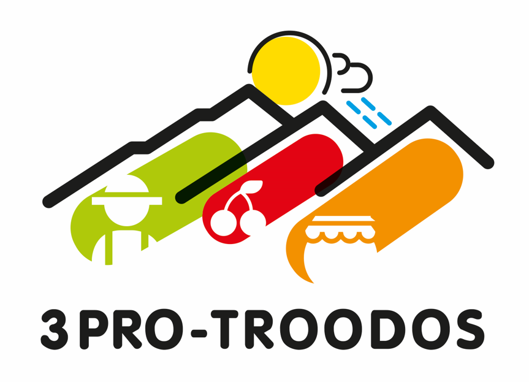

# Three Pro Troodos Introduction. 

The Troodos Mountains are the green heart of Cyprus. The mountains capture and manage the rains that form our natural water resources. Agricultural dry-stone terraces, rural communities and forests shape the diverse landscape of Troodos. The agricultural and food processing sectors in the Troodos Mountains have high potentials but also face many challenges.

The 3PRO-TROODOS Project is an Integrated Research Project (2019-2022), funded by the Research and Innovation Foundation of Cyprus, and coordinated by The Cyprus Institute. The project aims to improve agricultural production and food processing in the Troodos Mountains of Cyprus, through social innovation, sustainable natural resource management and climate change adaptation.

The 3PRO-TROODOS Consortium conducts research, in cooperation with the agri-food producers and processors of the Troodos Mountains, to achieve:

- A quality certification label for Troodos food products
- Improved fruit tree production with protective nets
- New products and practices for local herbs
- Maintenance and rehabilitation of agricultural dry-stone terraces
- Improved irrigation water use with wireless sensors and mobile Apps
- Guidelines for sustainable water use under current and future climate conditions
- Insights in the socioeconomic impact of quality labelling on Troodos

To perform the necessary research a number of wireless sensors had to be used to take various measurements of the state of the soil as well as the environmental conditions in an area. To keep all these data easily accessible, a sensor observation IoT platform had to be developed. 

This version of the platform uses an open source version of a platform (thingsboard) as a base, which offers great levels of configurability, scalability and security. The rest of the 3pro functionality has been build on top of that platform using extensive rules, custom dashboards, and widgets. 

This repository is forked from latest version of the thingsboard platform, but to keep the codebase as pure as possible, instructions about how to setup the platform for the 3Pro project, as well as extended documentation can be found on a different repository on the following link
[3ProTroodosV2-Introduction](https://github.com/sigintsolutions/3ProTroodosV2-Introduction) 

Additional tools that are used with conjuction with the platform can also be found on the following repositories

Tool to help configure a new device for the pro pro post processing algorithms: 

[3pro-Troodos-Field-Configurator](https://github.com/sigintsolutions/3pro-Troodos-Field-Configurator)

Tool to download telemetry data from a device
[3Pro-Data-Downloader](https://github.com/sigintsolutions/3Pro-Data-Downloader)

Tool to retroactively post process data:
[3pro-data-post-processor](https://github.com/sigintsolutions/3pro-data-post-processor)

Finaly the old obsolete version of the platform can be found on [3ProTroodosV1-Repository](https://github.com/sigintsolutions/3ProTroodosV1)

# ThingsBoard 

ThingsBoard is an open-source IoT platform for data collection, processing, visualization, and device management.

## Documentation

ThingsBoard documentation is hosted on [thingsboard.io](https://thingsboard.io/docs).

## IoT use cases

[**Smart farming**](https://thingsboard.io/smart-farming/)

[**IoT Rule Engine**](https://thingsboard.io/docs/user-guide/rule-engine-2-0/re-getting-started/)

## Getting Started

Collect and Visualize your IoT data in minutes by following this [guide](https://thingsboard.io/docs/getting-started-guides/helloworld/).

## Support

 - [Community chat](https://gitter.im/thingsboard/chat)
 - [Q&A forum](https://groups.google.com/forum/#!forum/thingsboard)
 - [Stackoverflow](http://stackoverflow.com/questions/tagged/thingsboard)

## Licenses

This project is released under [Apache 2.0 License](./LICENSE).
